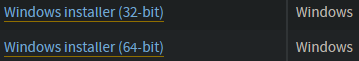

# Tutoriel d'installation et d'utilisation de l'application BD-Manga

## Setup de l'environnement sous Windows :
Si vous avez votre propre environnement, pas besoin de tout installer.

- Installez [python3.10.8](https://www.python.org/downloads/release/python-3108/) : 
 
Pour les options d'installation :
    - Cochez "Add python.exe to PATH"
    - Cliquez sur "Install Now"
- Installez une éditeur de python : [PyCharmCE](https://www.jetbrains.com/pycharm/download/#section=windows) (community edition)
ou [VSCode](https://code.visualstudio.com/download) (un peu plus dur à configurer). 
Faites juste attention à bien cocher l'option "ouvrir avec/en tant que projet PyCharm/VSCode"
- Installez [git](https://git-scm.com/downloads). Pour les options d'installation :
    - Cochez l'option "Git Bash here"
    - Choisissez "main" come "default branch name"
    - Cochez "Git from the command line and also from 3rd-party software"
    - 2 ou 3 options par défaut
    - Cochez "Checkout as-is, commit Unix-style line endings"
    - Cochez "Use Windows' default console window"
    - Le reste des options par défaut

## Téléchargement de l'application

- Choisissez l'endroit sur votre ordinateur où vous voulez mettre le fichier contenant l'application.
- Clique droit --> Ouvrir Git Bash
- Entrez la commande `git clone https://github.com/Leroymilo/ClubBDM-DB.git`.
- Clique droit sur le nouveau fichier (qui doit s'appeler "ClubBDM-DB") --> Ouvrir avec PyCharm/VSCode
- Refusez les options proposées (surtout sous PyCharm).
- Ouvrez un terminal (onglet terminal sous PyCharm).
- Entrez les commandes :
    - `python -m venv env`
    - `env/Scripts/activate` (Utilisez tab pour auto-compléter) 
    La mention `(env)` devrait apparaître en vert au début de vos lignes de commande à partir de maintenant.
    - `pip install -r requirements.txt` (le téléchargement prends du temps)

Pour initialiser la base de données, vous aurez besoin d'un inventaire (feuille excel bien formatée) ou d'une backup (.sql).

- Si vous avez un inventaire : 
    Lancez `read_inv.py` en entrant la commande `python read_inv.py` dans le terminal 
    (le bouton pour lancer le script de votre éditeur risque de ne pas prendre l'environnement virtuel en compte)
- Si vous avez une backup : 
    Renommez-la `dbBDM.sql`

Vous devriez pouvoir maintenant entrer la commande `python "BDM-App.py"` pour tester l'application.

## Mettre à jour et lancer l'application

- Ouvrez le dossier de l'application avec votre éditeur.
- Entrez la commande `git pull origin main`
- Vérifiez que l'environnement virtuel est bien activé (soit dans l'éditeur, soit dans le terminal avec la mention `(env)` en vert)
- Entrez la commande `python "BDM-App.py"`

Vous pouvez aussi mettre à jour la base de donnée elle même avec une backup ou un inventaire excel (bien formaté) comme décrit plus haut.